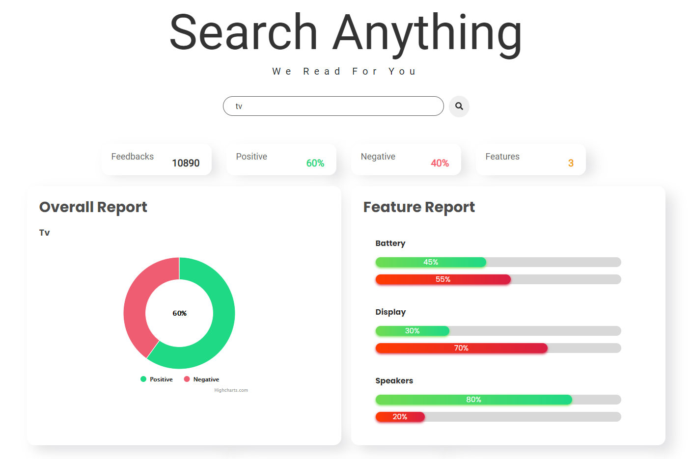

<h1 align="left">
    React Dashboard of the Feedback Analysis System
</h1>

    &nbsp;
    &nbsp;
    &nbsp;
    &nbsp;

This web application is used to create the user interaction of the system. Users can search the items they want to see the analysed output the system provides. Output generated by a developed sentiment analysis algorithm using SVM model. 

&nbsp;**Tech Stack of the Project**

- Web Scraping 
- Kafka
- Flask
- Sentiment Analysis(SVM)
- Node.js
- React
- MongoDB

### Deployed on: https://feedback-analyzer-1fef6.web.app/

## UI of the Application Dashboard

